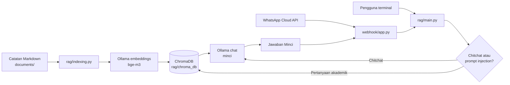

<div align="center">

<h1>Minci</h1>
<p><strong>Virtual Asisten Akademik STT Cipasung</strong></p>
<p>RAG lokal berbasis Ollama, ChromaDB, Markdown Obsidian, dan WhatsApp Cloud API.</p>

<a href="https://www.python.org/"></a>
<a href="https://fastapi.tiangolo.com/"></a>
<a href="https://www.trychroma.com/"></a>
<a href="https://ollama.com/"></a>
<a href="https://developers.facebook.com/docs/whatsapp/cloud-api/"></a>


<a href="https://github.com/zeniramadan/Virtual-Asisten-STTC/blob/main/LICENSE"></a>

</div>
<br>
<div style="border-left: 4px solid #0ea5e9; padding: 12px 16px; margin: 20px 0; background: #f0f9ff;">
Minci adalah asisten virtual akademik STT Cipasung yang membantu mahasiswa dan calon mahasiswa mencari informasi PMB, KRS, biaya kuliah, kalender akademik, program studi, beasiswa, dan layanan kampus. Minci menjawab berdasarkan dokumen resmi lokal melalui RAG dan model bahasa Ollama, serta dapat diakses dari terminal atau WhatsApp.
</div>

## Navigasi

<table>
<tr>
<td><a href="#fitur"><strong>Fitur</strong></a></td>
<td><a href="#arsitektur"><strong>Arsitektur</strong></a></td>
<td><a href="#instalasi"><strong>Instalasi</strong></a></td>
<td><a href="#menjalankan"><strong>Menjalankan</strong></a></td>
<td><a href="#evaluasi"><strong>Evaluasi</strong></a></td>
<td><a href="#troubleshooting"><strong>Troubleshooting</strong></a></td>
</tr>
</table>

## Tentang Proyek

Minci adalah prototipe asisten akademik untuk mahasiswa dan calon mahasiswa STT Cipasung. Cakupan informasi berasal dari empat catatan resmi di folder `documents/`:

| Sumber        | Isi yang tersedia                                                                                 |
| ------------- | ------------------------------------------------------------------------------------------------- |
| `PMB.md`      | Persyaratan pendaftaran, program studi, profil kampus, prospek kerja, UKM, kontak, dan beasiswa.  |
| `KRS.md`      | Login, pengisian dan pencetakan KRS, perwalian, batas SKS, pembayaran, IPK, dan status mahasiswa. |
| `BIAYA.md`    | Biaya awal, UKT, cicilan, biaya tiap semester, sidang, wisuda, dan total biaya kuliah.            |
| `KALENDER.md` | Jadwal PMB 2026 serta kalender akademik semester gasal 2026/2027.                                 |

Informasi yang tidak ada di catatan akan menghasilkan jawaban fallback. Sistem tidak melakukan pencarian web dan tidak dirancang untuk menjawab pertanyaan umum di luar cakupan dokumen.

## Fitur

<table>
<tr>
<td width="50%"><h3>Knowledge & RAG</h3><ul><li>Indexing file Markdown secara rekursif.</li><li>Frontmatter YAML dan tag Obsidian disimpan sebagai metadata.</li><li>Embedding menggunakan Ollama <code>bge-m3</code>.</li><li>Retrieval 15 kandidat, disaring dengan distance dan token overlap.</li><li>Maksimal 3 chunk dikirim ke model chat.</li></ul></td>
<td width="50%"><h3>Conversation</h3><ul><li>Deteksi chitchat dari <code>dataset/chitchat.json</code>.</li><li>Chitchat melewati retrieval dan tetap dijawab model lokal.</li><li>Fallback untuk konteks kosong.</li><li>Prompt injection ditolak sebelum retrieval.</li><li>Jawaban mengikuti gaya bahasa Minci yang ramah.</li></ul></td>
</tr>
<tr>
<td><h3>Integrasi</h3><ul><li>Chat interaktif melalui terminal.</li><li>FastAPI webhook untuk WhatsApp Cloud API.</li><li>Background task agar webhook segera membalas HTTP 200.</li><li>Deduplikasi message ID selama 5 menit.</li><li>Ngrok untuk expose webhook saat development.</li></ul></td>
<td><h3>Quality Checks</h3><ul><li>Hit Rate@k, Precision@k, Recall@k, dan NDCG@k.</li><li>Faithfulness scoring dengan judge Gemini.</li><li>Stress test untuk fallback dan prompt injection.</li><li>Inspector untuk melihat seluruh isi collection ChromaDB.</li></ul></td>
</tr>
</table>

## Arsitektur



### Alur Pertanyaan Akademik

1. `webhook/app.py` atau terminal menerima teks pengguna.
2. `rag/main.py` memeriksa prompt injection dan chitchat.
3. Pertanyaan akademik diubah menjadi embedding dengan `bge-m3`.
4. ChromaDB mengambil sampai 15 kandidat dari collection `obsidian_vault`.
5. Kandidat disaring dengan `MAX_DISTANCE = 0.60` dan token overlap.
6. Kandidat dengan exact tag diprioritaskan, lalu diurutkan berdasarkan distance, tag overlap, dan overlap isi.
7. Maksimal 3 chunk dibentuk menjadi context untuk model `minci`.
8. Jika tidak ada chunk yang lolos, sistem mengembalikan `FALLBACK_TEXT`.

### Parameter Retrieval

| Konstanta                   |            Nilai | Fungsi                               |
| --------------------------- | ---------------: | ------------------------------------ |
| `EMBED_MODEL`               |         `bge-m3` | Model embedding Ollama.              |
| `CHAT_MODEL`                |          `minci` | Model chat Ollama.                   |
| `RETRIEVAL_K`               |             `15` | Jumlah kandidat awal dari ChromaDB.  |
| `FINAL_CONTEXT_K`           |              `3` | Jumlah chunk yang dikirim ke model.  |
| `MAX_DISTANCE`              |           `0.60` | Batas maksimum cosine distance.      |
| `MIN_OVERLAP_IF_LONG_QUERY` |              `1` | Minimal overlap untuk query panjang. |
| `COLLECTION_NAME`           | `obsidian_vault` | Nama collection ChromaDB.            |

## Struktur Repository

```text
Virtual-Asisten-STTC/
├── dataset/
│   ├── chitchat.json              # Frasa greeting, smalltalk, thanks, dll.
│   ├── dataset_finetuning.json    # Contoh instruction/input/output fine-tuning
│   ├── dataset_minci.json         # Contoh percakapan dan context Minci
│   ├── ground_truth.json          # 42 kasus evaluasi retrieval/generation
│   └── stress_cases.json          # 10 kasus fallback dan guardrail
├── documents/                     # Vault Markdown sebagai sumber pengetahuan
│   ├── BIAYA.md
│   ├── KALENDER.md
│   ├── KRS.md
│   ├── PMB.md
│   └── .obsidian/                 # Konfigurasi vault lokal
├── llm/
│   ├── Modelfile                  # Template dan parameter model Minci
│   └── llama-3.2-3b-instruct.Q4_K_M.gguf
├── rag/
│   ├── main.py                    # ask(), retrieval, prompt, chat terminal
│   ├── indexing.py                # Parser Markdown dan indexing ChromaDB
│   ├── cek.py                     # Inspector collection dan seluruh chunk
│   ├── chroma_db/                 # Database vector hasil indexing
│   └── test/
│       ├── eval_retrieval.py      # Hit Rate, Precision, Recall, NDCG
│       ├── eval_faithfulness.py   # Judge faithfulness dengan Gemini
│       ├── eval_guardrail.py      # Stress test fallback dan injection
│       ├── run_all.py             # Menjalankan tiga evaluator
│       ├── GUIDE.md               # Panduan evaluator
│       └── results/                # JSON hasil evaluasi per timestamp
├── training/
│   └── model_training.ipynb       # Notebook training/fine-tuning
├── webhook/
│   └── app.py                     # FastAPI WhatsApp webhook
├── env.example                    # Template credential WhatsApp
├── pertanyaan.md                  # Daftar pertanyaan dan ekspektasi jawaban
├── webhook.txt                    # Catatan command webhook lama
├── requirements.txt               # Dependency runtime utama
└── README.md
```

<div style="border-left: 4px solid #f59e0b; padding: 12px 16px; margin: 16px 0; background: #fffbeb;">
<strong>Artefak lokal:</strong> <code>rag/chroma_db/</code>, <code>venv/</code>, <code>.obsidian/</code>, <code>__pycache__/</code>, dan file hasil evaluasi bukan source code utama. Database Chroma harus dibuat ulang dengan indexing, bukan diedit manual.
</div>

## Prasyarat

- Python 3.10 atau lebih baru.
- Ollama terpasang dan service Ollama aktif.
- Model embedding `bge-m3`.
- Model chat `minci`, dibuat dari GGUF lokal di folder `llm/`.
- Meta Developer App dan kredensial WhatsApp jika webhook akan digunakan.
- Ngrok untuk menerima callback Meta dari internet saat development.
- `google-genai` dan `GEMINI_API_KEY` hanya untuk evaluasi faithfulness.

Install Ollama dari [ollama.com/download](https://ollama.com/download).

## Instalasi

### 1. Buat environment Python

```powershell
git clone <URL-REPOSITORY>
cd Virtual-Asisten-STTC
python -m venv .venv
.\.venv\Scripts\Activate.ps1
python -m pip install --upgrade pip
pip install -r requirements.txt
```

Jika aktivasi PowerShell diblokir:

```powershell
.\.venv\Scripts\python.exe -m pip install -r requirements.txt
```

### 2. Siapkan Ollama

```powershell
ollama pull bge-m3
ollama create minci -f llm\Modelfile
ollama list
```

`llm/Modelfile` menggunakan file `llama-3.2-3b-instruct.Q4_K_M.gguf` dan mengatur template Llama, stop token, `temperature = 0.1`, `top_p = 0.5`, serta `num_ctx = 4096`.

Tes model:

```powershell
ollama run minci
```

`rag/main.py` memakai `CHAT_MODEL = "minci"` dan `EMBED_MODEL = "bge-m3"`. Jika model chat diberi nama lain, ubah `CHAT_MODEL` di file tersebut.

## Indexing Dokumen

Sumber pengetahuan ada di `documents/` dan menggunakan format Obsidian Markdown. `rag/indexing.py` membaca frontmatter YAML, heading, isi section, dan inline tag.

```powershell
python rag\indexing.py
```

Untuk vault lain:

```powershell
python rag\indexing.py path\ke\vault
```

Proses indexing:

1. Menghapus database `rag/chroma_db/` lama.
2. Mencari semua file `.md` secara rekursif.
3. Melewati folder `.obsidian` dan `.trash`.
4. Memecah note berdasarkan heading level 1 sampai 6.
5. Memecah section besar menjadi chunk maksimal sekitar 4000 karakter.
6. Membuat embedding tiap chunk dengan `bge-m3`.
7. Menyimpan metadata `path`, `title`, `tags`, dan `mtime` ke collection `obsidian_vault`.

Jalankan indexing setiap kali catatan berubah. Di Windows, tutup terminal chat, server webhook, dan kernel notebook yang sedang membuka ChromaDB sebelum indexing ulang.

## Menjalankan

### Chat terminal

Jalankan dari root repository:

```powershell
python rag\main.py
```

Ketik pertanyaan pada prompt `Kamu:`. Ketik `exit` atau `quit` untuk keluar.

Contoh:

```text
Syarat daftar PMB apa saja?
Cara mengisi KRS online bagaimana?
UKT per semester berapa?
Jadwal UTS kapan?
Alamat kampus dimana?
```

Satu pertanyaan tanpa mode interaktif:

```powershell
python -c "import sys; sys.path.insert(0, 'rag'); from main import ask; print(ask('Syarat daftar PMB apa saja?'))"
```

### Inspeksi ChromaDB

Untuk mencetak jumlah chunk, metadata, ID, dan isi seluruh collection:

```powershell
python rag\cek.py
```

Gunakan setelah indexing untuk memastikan note benar-benar masuk ke database.

### Debug retrieval

`DEBUG = True` di `rag/main.py` mencetak token query, distance, overlap isi, overlap tag, exact tag, status kandidat, dan preview chunk yang dipilih. Ini membantu membedakan masalah indexing, threshold retrieval, model embedding, dan model chat.

## Integrasi WhatsApp

### Environment

Salin template environment ke root repository:

```powershell
Copy-Item env.example .env
```

Isi nilai dari Meta Developer:

```env
WA_VERIFY_TOKEN=minci-verify-token-rahasia
WA_ACCESS_TOKEN=isi_access_token_disini
WA_PHONE_NUMBER_ID=isi_phone_number_id_disini
WA_API_VERSION=v20.0
```

`WA_VERIFY_TOKEN` harus sama dengan Verify Token pada dashboard Meta. `TELEGRAM_TOKEN` yang masih tercantum di `env.example` adalah konfigurasi legacy dan tidak dibaca oleh `webhook/app.py`.

### Menjalankan server

```powershell
cd webhook
python -m uvicorn app:app --host 0.0.0.0 --port 8000
```

Endpoint yang tersedia:

| Method | Endpoint   | Fungsi                                                   |
| ------ | ---------- | -------------------------------------------------------- |
| `GET`  | `/`        | Health check.                                            |
| `GET`  | `/webhook` | Verifikasi callback Meta menggunakan `hub.verify_token`. |
| `POST` | `/webhook` | Menerima pesan WhatsApp dan menjadwalkan balasan.        |

Health check lokal:

```text
http://localhost:8000/
```

Expose dengan ngrok:

```powershell
ngrok http 8000
```

Gunakan URL HTTPS publik dari ngrok dengan suffix `/webhook` sebagai callback URL Meta, lalu subscribe ke field `messages`.

### Perilaku webhook

- Payload status seperti delivered/read diabaikan.
- Pesan non-teks mendapat balasan bahwa Minci baru mendukung pesan teks.
- Pesan teks diproses oleh `ask()` melalui background task.
- Endpoint mengembalikan `{"status": "ok"}` tanpa menunggu proses LLM selesai.
- ID pesan yang sama dilewati selama `300` detik untuk mencegah balasan ganda.
- Kegagalan proses dikirim sebagai pesan teknis singkat dan dicatat ke log.
- Request ke WhatsApp Graph API memiliki timeout `30` detik.

## Evaluasi

Evaluator berada di `rag/test/` dan membaca dataset dari folder `dataset/`. Set `MODULE_NAME=main` agar evaluator mengimpor `rag/main.py`.

### Retrieval quality

Mengukur Hit Rate@k, Precision@k, Recall@k, dan NDCG@k berdasarkan `expected_title` pada `dataset/ground_truth.json`:

```powershell
$env:MODULE_NAME = "main"
python rag\test\eval_retrieval.py --k 3
```

Dataset saat ini berisi 42 pertanyaan dengan target note `PMB`, `KRS`, `BIAYA`, atau `KALENDER`.

### Faithfulness

Jawaban tetap dibuat oleh Ollama lokal. Gemini hanya digunakan sebagai judge eksternal untuk memecah jawaban menjadi klaim `SUPPORTED` atau `UNSUPPORTED`.

```powershell
pip install google-genai
$env:MODULE_NAME = "main"
$env:GEMINI_API_KEY = "isi-api-key"
python rag\test\eval_faithfulness.py --judge-model gemini-3.5-flash-lite
```

Request judge memiliki jeda default 13 detik dan retry untuk rate limit. Opsi yang tersedia antara lain `--dataset`, `--judge-model`, `--request-delay`, dan `--out`.

### Guardrail / stress test

Menguji pertanyaan di luar konteks, ambigu, prompt injection, dan jailbreak:

```powershell
$env:MODULE_NAME = "main"
python rag\test\eval_guardrail.py
```

Dataset saat ini berisi 10 kasus. Hasil memeriksa fallback, kebocoran internal, dan kepatuhan terhadap manipulasi prompt.

### Semua evaluasi

```powershell
$env:MODULE_NAME = "main"
python rag\test\run_all.py
```

Hasil JSON dibuat di `rag/test/results/<timestamp>/` dengan file `retrieval.json`, `faithfulness.json`, dan `guardrail.json`. Hasil tersimpan yang ada di repository mencatat retrieval run `20260911_085111` dengan Hit Rate@3 `100%`, Precision@3 rata-rata `89.68%`, Recall@3 `100%`, dan NDCG@3 rata-rata `99.12%`. Angka tersebut adalah snapshot, bukan jaminan setiap run.

Panduan metrik dan interpretasi tersedia di [rag/test/GUIDE.md](rag/test/GUIDE.md).

## Dataset dan Training

| File                              | Peran                                                                                                                                   |
| --------------------------------- | --------------------------------------------------------------------------------------------------------------------------------------- |
| `dataset/chitchat.json`           | Daftar frasa greeting, smalltalk, terima kasih, dan percakapan ringan yang dipakai detektor chitchat.                                   |
| `dataset/dataset_finetuning.json` | Pasangan instruction, input, dan output untuk contoh fine-tuning.                                                                       |
| `dataset/dataset_minci.json`      | Contoh percakapan Minci dengan context dan jawaban.                                                                                     |
| `dataset/ground_truth.json`       | Pertanyaan dengan target judul note untuk evaluasi retrieval dan faithfulness.                                                          |
| `dataset/stress_cases.json`       | Kasus out-of-context, ambigu, prompt injection, dan jailbreak.                                                                          |
| `pertanyaan.md`                   | Kumpulan pertanyaan manual dan ekspektasi jawaban, termasuk kasus fallback.                                                             |
| `training/model_training.ipynb`   | Notebook fine-tuning LoRA di Google Colab menggunakan Unsloth, PyTorch, TRL, PEFT, Accelerate, BitsAndBytes, dan Hugging Face Datasets. |

### Library dan Alur Fine-tuning

Notebook `training/model_training.ipynb` bukan bagian dari runtime RAG harian. Notebook tersebut digunakan untuk melatih gaya respons model Minci di GPU Google Colab, terutama GPU T4:

| Komponen             | Peran                                                                 |
| -------------------- | --------------------------------------------------------------------- |
| `torch`              | Backend tensor dan deteksi dukungan `fp16`/`bf16`.                    |
| `unsloth`            | Memuat Llama 3.2 3B 4-bit, memasang LoRA, inference, dan export GGUF. |
| `trl`                | `SFTTrainer` dan `SFTConfig` untuk supervised fine-tuning.            |
| `peft`               | Adapter LoRA untuk fine-tuning parameter-efficient.                   |
| `accelerate`         | Dukungan eksekusi training pada GPU.                                  |
| `bitsandbytes`       | Optimizer 8-bit `adamw_8bit` dan model quantization.                  |
| `datasets`           | Mengubah JSON instruction dataset menjadi Hugging Face Dataset.       |
| `google.colab.files` | Upload dataset dan download file GGUF dari Google Colab.              |

Alur notebook:

1. Install Unsloth serta library training pendukung.
2. Memuat base model `unsloth/Llama-3.2-3B-Instruct` dalam 4-bit.
3. Memasang adapter LoRA pada modul attention dan MLP.
4. Mengunggah dataset JSON dengan format `instruction`, `input`, dan `output`.
5. Mengubah data menjadi chat template Llama dengan system prompt persona Minci.
6. Melatih menggunakan `SFTTrainer` selama 3 epoch dengan cosine scheduler.
7. Menguji respons KRS secara singkat.
8. Mengekspor hasil ke GGUF quantization `q4_k_m` untuk digunakan oleh Ollama.

Library training tersebut perlu dipasang di environment notebook/Google Colab, bukan ditambahkan ke `requirements.txt` runtime utama.

## Troubleshooting

### `ModuleNotFoundError`

Pastikan environment aktif dan dependency root terpasang:

```powershell
pip install -r requirements.txt
```

### `ollama` gagal terhubung atau model tidak ditemukan

Pastikan Ollama berjalan, lalu cek:

```powershell
ollama list
ollama pull bge-m3
ollama run minci
```

### Chroma kosong atau selalu fallback

1. Jalankan `python rag\indexing.py`.
2. Jalankan `python rag\cek.py` dan pastikan jumlah chunk lebih dari nol.
3. Pastikan pertanyaan masih termasuk cakupan empat note.
4. Aktifkan `DEBUG = True` dan periksa distance serta overlap.
5. Pastikan proses lama tidak mengunci `rag/chroma_db/`.

### Evaluator gagal mengimpor modul

Gunakan PowerShell dari root repository:

```powershell
$env:MODULE_NAME = "main"
python rag\test\eval_retrieval.py --k 3
```

### Faithfulness tidak memiliki skor

Pastikan `google-genai` terpasang, `GEMINI_API_KEY` terisi, dan nama model judge didukung API. Jangan memasukkan API key ke file `.env` yang akan dibagikan atau di-commit.

### Webhook tidak terverifikasi

Periksa `WA_VERIFY_TOKEN`, URL callback yang berakhiran `/webhook`, subscription field `messages`, dan status server Uvicorn. Meta harus menerima challenge dalam response `200` saat token cocok.

### WhatsApp tidak membalas atau membalas dua kali

Periksa access token, phone number ID, versi Graph API, log server, koneksi Ollama, dan tunnel. Deduplicator hanya menyimpan ID di memory proses selama lima menit; restart server akan menghapus cache deduplikasi.

## Keamanan dan Batasan

- Jangan commit `.env`, access token Meta, atau `GEMINI_API_KEY`.
- Jangan membuka endpoint webhook ke publik tanpa HTTPS stabil, rate limiting, dan kontrol akses yang sesuai.
- Payload dan jawaban WhatsApp dicatat di log; pertimbangkan privasi data pengguna sebelum deployment.
- Model hanya menjawab berdasarkan context yang diambil dari dokumen lokal.
- Data akademik di dokumen dapat berubah; lakukan indexing ulang setelah sumber diperbarui.
- `BackgroundTasks` FastAPI cocok untuk prototipe, bukan antrean produksi yang tahan restart.
- Token deduplikasi webhook masih in-memory dan belum dibagi antar-instance.

## Referensi File

- [RAG pipeline](rag/main.py)
- [Markdown indexer](rag/indexing.py)
- [ChromaDB inspector](rag/cek.py)
- [WhatsApp webhook](webhook/app.py)
- [Ollama Modelfile](llm/Modelfile)
- [Dependency runtime](requirements.txt)
- [Environment template](env.example)
- [Panduan evaluasi](rag/test/GUIDE.md)
- [Pertanyaan manual](pertanyaan.md)

## Lisensi

Proyek ini dilisensikan di bawah [MIT License](https://github.com/zeniramadan/Virtual-Asisten-STTC/blob/main/LICENSE).
